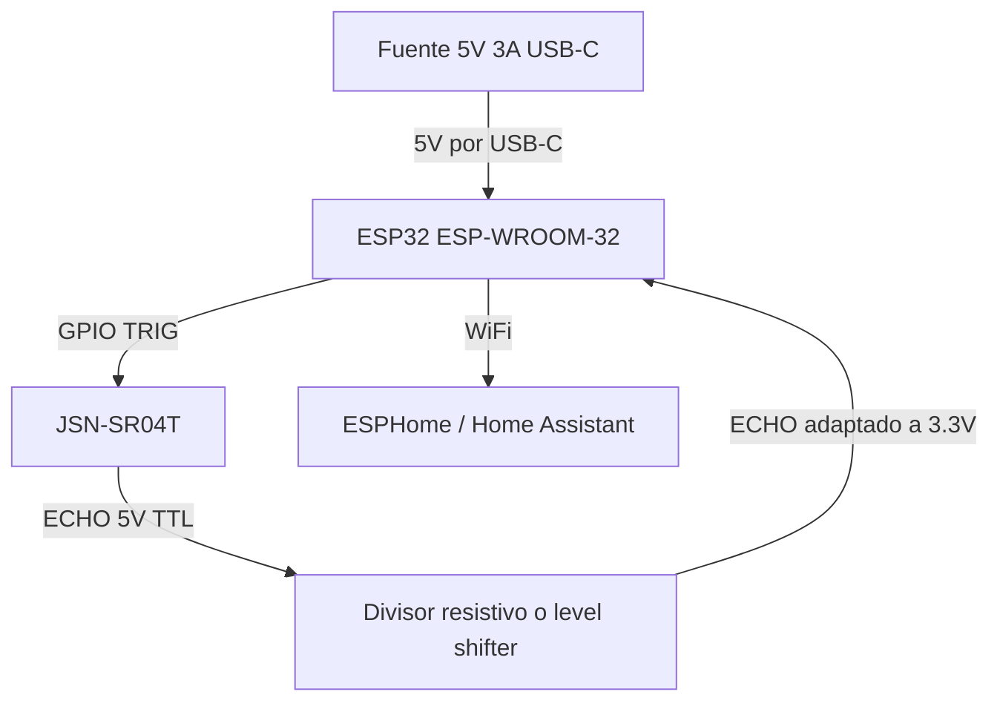

# Propuesta — Sistema Inteligente de Monitoreo de Cisterna

## Objetivo

Desarrollar un sistema de monitoreo inteligente para la cisterna de agua de mi casa con el objetivo de visualizar en tiempo real el nivel disponible, obtener métricas históricas de consumo y generar alertas automáticas relacionadas con el abastecimiento y uso del agua.

El sistema estará orientado a una arquitectura IoT modular, escalable y completamente autoadministrada, permitiendo futuras integraciones con automatizaciones domésticas y análisis predictivo.

---

# Alcance Inicial (MVP)

La primera etapa del proyecto consistirá en:

- Medir el nivel de agua de la cisterna
    
- Calcular el porcentaje de llenado
    
- Estimar litros disponibles
    
- Registrar históricos de consumo
    
- Visualizar métricas en dashboard
    
- Generar alertas automáticas cuando el nivel sea bajo
    

---

# Arquitectura General

```text
Cisterna
   ↓
Sensor de nivel
   ↓
ESP32
   ↓ WiFi
MQTT / ESPHome
   ↓
Servidor Home Assistant
   ↓
Dashboard / Alertas / Históricos
```

---

# Tecnologías Propuestas

## Hardware

### Microcontrolador

- ESP 32
    
- Conectividad WiFi integrada
    
- Bajo consumo energético
    
- Amplia compatibilidad con ecosistema IoT
    

### Sensor de nivel

Se evaluarán principalmente dos alternativas:

#### Opción A — Sensor ultrasónico impermeable

Ejemplo:

- JSN-SR 04 T
    

Ventajas:

- Instalación sencilla
    
- No requiere contacto directo con el agua
    
- Bajo costo
    
- Fácil mantenimiento
    

Desventajas:

- Posible ruido por humedad o condensación
    
- Variaciones menores por eco o turbulencia
    

---

#### Opción B — Sensor de presión sumergible

Ventajas:

- Alta precisión
    
- Mediciones estables
    

Desventajas:

- Mayor costo
    
- Requiere instalación dentro de la cisterna
    
- Mayor complejidad de mantenimiento
    

---

# Software

## Firmware

### ESPHome

Se utilizará ESPHome para:

- Configuración del ESP 32
    
- Lectura del sensor
    
- Integración automática con Home Assistant
    
- Actualizaciones OTA
    

---

## Backend / Automatización

### Home Assistant

Permitirá:

- Dashboards
    
- Automatizaciones
    
- Alertas
    
- Integración futura con otros dispositivos
    

---

## Métricas y Visualización

### Grafana + InfluxDB

Se utilizarán para:

- Históricos de consumo
    
- Análisis temporal
    
- Estadísticas de uso
    
- Tendencias y predicciones
    

---

# Funcionalidades Planeadas

## Nivel de Agua

- Porcentaje de llenado
    
- Litros estimados
    
- Altura del agua
    

---

## Históricos

- Consumo diario
    
- Consumo semanal
    
- Consumo mensual
    
- Eventos de llenado
    

---

## Alertas

- Nivel bajo
    
- Nivel crítico
    
- Detección de llenado
    
- Detección de comportamiento anómalo
    

Notificaciones posibles:

- Telegram
    
- Discord
    
- Push notifications
    
- Email
    

---

# Futuras Mejoras

## Integración de medidor de flujo

Agregar sensores de flujo permitirá:

- Medir consumo exacto
    
- Detectar fugas
    
- Calcular entrada y salida de agua
    
- Analizar eficiencia
    


---

## Analítica Predictiva

Se contempla implementar:

- Predicción de agotamiento
    
- Detección de fugas mediante patrones
    
- Estimación de consumo futuro
    
- Modelado de comportamiento de uso
    

---

# Consideraciones Técnicas

## Precisión

El cálculo de litros dependerá de:

- Dimensiones reales de la cisterna
    
- Forma geométrica
    
- Precisión del sensor
    

---

## Conectividad

El sistema dependerá de conectividad WiFi local para transmisión de datos.

Se contempla como mejora futura:

- LoRa
    
- Comunicación offline
    
- Respaldo energético
    

---

# Estimación Inicial de Componentes

| Componente                     | Cantidad |
| ------------------------------ | -------- |
| ESP 32                         | 1        |
| Sensor ultrasónico impermeable | 1        |
| Fuente de alimentación         | 1        |
| Caja impermeable               | 1        |
| Cableado y conectores          | Varios   |

---

# Objetivo Final

El objetivo final es construir una plataforma doméstica de monitoreo hídrico que permita:

- Tener visibilidad en tiempo real del agua disponible
    
- Optimizar consumo
    
- Detectar problemas antes de que ocurran
    
- Automatizar procesos relacionados con abastecimiento
    
- Centralizar métricas históricas y analítica
    

El sistema deberá mantenerse modular para permitir futuras expansiones sin necesidad de rediseñar la arquitectura principal.


## Referencias de Compra

Incluyo algunas referencias iniciales de componentes compatibles con la primera etapa del proyecto.

### Referencias verificadas para este MVP

Precios verificados el 14 de mayo de 2026 en UNIT Electronics.

---

## 1. Microcontrolador principal

### ESP32 38 Pines ESP WROOM 32 MicroUSB / USB-C

Referencia:

- [ESP32 38 Pines ESP WROOM 32 MicroUSB / USB-C](https://uelectronics.com/producto/esp32-38-pines-esp-wroom-32-microusb-usb-c/)

Precio actual observado:

- Rango publicado: $130.00 a $156.00 MXN
- La pagina muestra explicitamente la variante MicroUSB en $130.00 MXN
- La variante USB-C parece corresponder al extremo alto del rango publicado

Funcion dentro del sistema:

- Actuara como el nodo central de adquisicion y comunicacion
- Leerá el sensor de nivel
- Convertira la distancia medida en altura de agua, porcentaje de llenado y litros estimados
- Enviara telemetria por WiFi a Home Assistant mediante ESPHome o MQTT
- Permitira actualizaciones OTA y futuras ampliaciones del nodo

Especificaciones relevantes:

- Modulo ESP-WROOM-32
- 38 pines para expansion
- WiFi 2.4 GHz integrado
- Bluetooth 4.2 / BLE
- Doble nucleo Tensilica LX6 a 240 MHz
- 520 KB SRAM
- 4 MB flash
- Chip USB-serial CP2102
- Alimentacion a 5 V por MicroUSB o USB-C
- GPIO de logica a 3.3 V
- Soporte de UART, SPI, I2C, I2S, ADC, DAC y PWM

Por que encaja con este proyecto:

- Es totalmente compatible con la arquitectura IoT planteada en la nota
- Tiene conectividad suficiente para Home Assistant sin hardware adicional
- Tiene margen para agregar sensores de flujo, temperatura o estado de bomba
- Es una plataforma muy estable para ESPHome y automatizacion domestica

Consideraciones practicas:

- Si quieres conectar directamente la fuente enlazada, conviene comprar la variante USB-C
- Si compras la variante MicroUSB, necesitaras otro cable o un adaptador
- El ESP32 trabaja a 3.3 V en GPIO, asi que cualquier retorno de 5 V del sensor debe acondicionarse antes de entrar al microcontrolador

Recomendacion:

- Para este setup en particular, la variante USB-C es la opcion mas coherente por compatibilidad fisica con la fuente propuesta

---

## 2. Sensor de medicion de nivel

### Sensor Ultrasonico Contra El Agua JSN-SR04T

Referencia:

- [Sensor Ultrasonico Contra El Agua JSN-SR04T](https://uelectronics.com/producto/sensor-ultrasonico-jns-sr04t/)

Precio actual observado:

- Precio unitario: $94.00 MXN
- Precio por volumen: 10 piezas $82.66, 25 piezas $74.01, 35 piezas $66.99

Funcion dentro del sistema:

- Medira la distancia desde el punto de montaje hasta la lamina de agua
- Esa distancia se convertira en nivel util de agua dentro de la cisterna
- Con la altura interna conocida, permitira calcular porcentaje de llenado
- Con las dimensiones reales de la cisterna, permitira estimar litros disponibles
- Sera la base para alertas de nivel bajo, nivel critico y deteccion de llenado

Especificaciones relevantes:

- Dispositivo base: JSN SR04T
- Modelo: AJ-SR04M
- Voltaje de operacion: 5 VDC
- Corriente de trabajo: 30 mA
- Rango de deteccion: 25 a 450 cm
- Zona muerta: menor a 20 cm
- Precision nominal: 3 mm
- Frecuencia de emision: 40 KHz
- Pulso minimo de disparo TTL: 10 us
- Tiempo minimo entre mediciones: 20 ms
- Angulo de deteccion: menor a 50 grados
- Temperatura de trabajo: -10 C a 70 C
- Transductor frontal a prueba de agua

Por que encaja con este proyecto:

- No requiere contacto directo con el agua
- El cabezal impermeable es adecuado para ambiente humedo
- Tiene costo bajo para un MVP domestico
- El rango de trabajo es suficiente para muchas cisternas residenciales si se monta desde arriba

Como se usaria aqui:

- Se montaria en la tapa o parte superior de la cisterna, apuntando verticalmente al agua
- La lectura representa el espacio vacio, no el nivel lleno
- El nivel real se obtiene con una calibracion del tipo: altura_util = altura_total - distancia_medida - offset_de_montaje
- Conviene filtrar lecturas con mediana o promedio movil para reducir ecos falsos, turbulencia y salpicaduras

Riesgos y limites:

- La zona muerta menor a 20 cm impide medir bien cuando el agua esta demasiado cerca del sensor
- Puede haber ruido si el chorro de llenado cae justo debajo del transductor
- La condensacion y los rebotes internos pueden degradar la estabilidad de lectura
- Aunque la tienda lo considera compatible con ESP32, en integracion real conviene asumir que ECHO sale a 5 V TTL y bajar ese nivel a 3.3 V con divisor resistivo o level shifter

Recomendacion:

- Es una muy buena opcion de arranque para el MVP siempre que se instale lejos de la entrada de agua y se haga una calibracion inicial cuidadosa

---

## 3. Alimentacion del nodo

### Eliminador 5V 3A USB C

Referencia:

- [Eliminador 5V 3A USB C](https://uelectronics.com/producto/fuente-de-alimentacion-5v-3a-usb-c/)

Precio actual observado:

- Precio unitario: $65.00 MXN
- Precio por volumen: 10 piezas $56.88, 25 piezas $50.61, 35 piezas $45.59

Funcion dentro del sistema:

- Alimentara el ESP32 de forma continua
- Puede alimentar tambien el sensor desde la misma linea de 5 V
- Proporciona margen suficiente para picos de consumo del WiFi
- Reduce el riesgo de inestabilidad frente a una fuente USB improvisada

Especificaciones relevantes:

- Modelo: ANU-050300
- Entrada: 100 V a 240 VAC
- Frecuencia: 50/60 Hz
- Salida: 5 VDC
- Corriente maxima: 3 A
- Potencia: 15 W
- Conector: USB tipo C
- Longitud del cable: 110 cm aprox.
- Dimensiones: 75 mm x 40.40 mm x 52 mm
- Peso: 83 g

Por que encaja con este proyecto:

- El ESP32 recibe 5 V por USB y el sensor tambien opera a 5 V
- Los 3 A dejan margen suficiente para la tarjeta, el sensor y pequenos perifericos futuros
- El conector USB-C simplifica el montaje si eliges la version USB-C del ESP32

Consideraciones practicas:

- La fuente AC/DC no deberia instalarse expuesta dentro de la zona humeda
- Lo correcto es dejar la conversion de red electrica fuera del ambiente agresivo y llevar solo bajo voltaje al gabinete
- Si el gabinete queda lejos del contacto electrico, hay que planear pasacables, alivio de tension y proteccion mecanica

Recomendacion:

- Es una buena fuente para operacion fija del nodo, mas apropiada que depender de un cargador generico sin criterio

---

## Integracion recomendada de los tres componentes

Conexion sugerida:

- Fuente USB-C 5 V 3 A -> ESP32 por USB-C
- ESP32 -> JSN-SR04T por 5 V, GND, TRIG y ECHO
- ECHO del sensor -> divisor resistivo o adaptacion de nivel antes del GPIO del ESP32
- ESP32 -> WiFi -> ESPHome / Home Assistant

Diagrama de conexion:

```text
                Corriente de pared
                       |
                       v
            +----------------------+
            | Fuente 5V 3A USB-C   |
            +----------------------+
                       |
                       | USB-C 5V
                       v
            +----------------------+
            |       ESP32          |
            |   ESP-WROOM-32       |
            |                      |
            | 5V/VIN  <------------+  alimentacion
            | GND     <------------+  tierra comun
            | GPIO X  -----------> TRIG
            | GPIO Y  <----------- ECHO
            +----------------------+
                       ^
                       |
             ECHO pasa antes por
          divisor resistivo / level shifter
                       |
            +----------------------+
            |     JSN-SR04T        |
            |                      |
            | VCC  <--------------- 5V
            | GND  <--------------- GND
            | TRIG <--------------- GPIO X
            | ECHO ---------------> GPIO Y
            +----------------------+
```

Diagrama logico:



Pines recomendados a nivel conceptual:

- `VCC` del sensor -> `5V` o `VIN` del ESP32
- `GND` del sensor -> `GND` del ESP32
- `TRIG` del sensor -> cualquier `GPIO` de salida del ESP32
- `ECHO` del sensor -> cualquier `GPIO` de entrada del ESP32 pasando antes por divisor resistivo o level shifter

Ejemplo practico de asignacion:

- `TRIG` -> `GPIO 5`
- `ECHO` -> `GPIO 18`

Nota de seguridad electrica:

- No conviene conectar `ECHO` directo al ESP32 si el sensor entrega nivel alto de `5 V`
- Lo correcto es bajar esa señal a `3.3 V` antes de entrar al `GPIO`

Funcion global:

- El sensor mide la distancia al agua
- El ESP32 procesa y calibra la medicion
- Home Assistant recibe el dato y lo convierte en dashboard, historicos y alertas

Piezas adicionales que siguen faltando:

- Caja o gabinete impermeable IP65 o superior
- Pasacables y conectores adecuados
- Divisor resistivo o level shifter para proteger el GPIO del ESP32
- Cableado interno, fijaciones y posiblemente borneras

Costo actualizado de la base electronica:

|Componente|Precio actual|
|---|---|
|ESP32 38 Pines ESP WROOM 32|$130.00 - $156.00 MXN|
|Sensor Ultrasonico JSN-SR04T|$94.00 MXN|
|Fuente 5V 3A USB-C|$65.00 MXN|
|Subtotal electronica base|$289.00 - $315.00 MXN|

Escenario recomendado:

- Si se compra el ESP32 con USB-C para empatarlo directamente con la fuente, la base electronica queda alrededor de $315.00 MXN antes de gabinete y accesorios

Nota:

- Este subtotal no incluye caja impermeable, cableado, adaptacion de nivel para ECHO ni materiales de montaje

---

## Centro de visualizacion local del sistema

### Pantalla tactil 5" para Raspberry Pi

Referencia:

- [Amazon MX - ASIN B0CP3DH3LN](https://www.amazon.com.mx/dp/B0CP3DH3LN/)

Identificacion del producto:

- Pantalla tactil capacitiva de `5"` para `Raspberry Pi`
- Resolucion nativa `800 x 480`
- Interfaz `HDMI`
- Alimentacion `5 V`
- Compatibilidad tipica con `Raspberry Pi`, `Jetson Nano` y equipos con salida `HDMI`

Funcion dentro de la solucion:

- Serviria como centro local de visualizacion del dashboard
- Permitiria ver el nivel de agua sin abrir el celular
- Puede montarse en cocina, cuarto de lavado, cochera o cuarto tecnico
- Es util para mostrar widgets grandes, alertas, historicos cortos y estado general del sistema

Arquitectura correcta para usar esta pantalla:

- `ESP32` mide y envia datos
- `Home Assistant` recibe, historiza y calcula entidades derivadas
- `Raspberry Pi` o mini PC renderiza el dashboard en esta pantalla
- La pantalla funciona como interfaz local, no como controlador principal del sensor

Importante:

- El `ESP32` no es la plataforma adecuada para mover una interfaz tipo dashboard rica como Home Assistant Lovelace en esa pantalla
- La opcion tecnicamente limpia es usar una `Raspberry Pi` dedicada en modo kiosco o reutilizar el servidor que ya corre Home Assistant si dispone de salida de video

Opciones de implementacion:

- `Opcion A`: usar solo dashboard web en celular o laptop en la primera etapa
- `Opcion B`: agregar `Raspberry Pi + pantalla 5"` como panel fijo de consulta
- `Opcion C`: usar una tablet Android vieja como panel mural y omitir la pantalla HDMI
- `Opcion D`: usar un monitor mas grande si el objetivo es un centro de control domestico mas general

Ventajas de esta pantalla:

- Tamaño compacto para montaje fijo
- Toque capacitivo para interaccion directa
- Suficiente resolucion para indicadores, botones grandes y graficas simples
- Bajo consumo comparado con un monitor tradicional

Limites practicos:

- `800 x 480` puede quedarse corto para dashboards recargados
- En `5"` conviene disenar vistas muy simples, con pocas tarjetas y tipografia grande
- Si se quiere ver historicos densos o muchas metricas al mismo tiempo, una tablet o monitor mayor sera mejor opcion

Recomendacion de uso:

- Usar esta pantalla para un dashboard minimalista de estado rapido
- Reservar vistas avanzadas, historicos extensos y configuracion para celular o PC

---

## Evolucion del dashboard y del sistema por etapas

### Etapa 1 - MVP funcional

Objetivo:

- Saber cuanta agua queda y recibir alertas basicas

Metricas recomendadas:

- Nivel actual en porcentaje
- Litros estimados
- Altura de agua en cm
- Ultima lectura valida
- Estado del nodo `online/offline`
- Alerta de nivel bajo

Visualizacion recomendada:

- Dashboard web simple en Home Assistant
- Semaforo visual: normal, bajo, critico

### Etapa 2 - Operacion diaria mas util

Objetivo:

- Entender mejor el comportamiento cotidiano de consumo y recarga

Metricas y funciones sugeridas:

- Consumo diario estimado
- Consumo semanal y mensual
- Horas o dias estimados restantes
- Deteccion de eventos de llenado
- Duracion de cada llenado
- Velocidad aproximada de recuperacion del nivel
- Alerta por falta de actualizacion del sensor

Visualizacion recomendada:

- Pantalla fija local con resumen rapido
- Graficas de tendencia de 24 horas y 7 dias

### Etapa 3 - Instrumentacion ampliada

Objetivo:

- Mejorar precision y detectar problemas reales del sistema hidraulico

Mejoras de hardware:

- Medidor de flujo en entrada
- Medidor de flujo en salida o en linea principal
- Sensor de estado de bomba

Metricas nuevas:

- Litros entrantes reales
- Litros salientes reales
- Diferencia entre consumo estimado y medido


### Etapa 4 - Sistema domestico inteligente

Objetivo:

- Convertir la medicion en una plataforma de decisiones y automatizacion

Funciones avanzadas:

- Prediccion de agotamiento
- Deteccion de patrones atipicos
- Integracion con clima y dias de mayor consumo
- Automatizacion de bomba o valvulas
- Reportes semanales y mensuales
- Integracion con Telegram, WhatsApp, email o notificaciones push

---

## Diseno recomendado del dashboard local

Vista principal sugerida:

- Tarjeta grande con `% de llenado`
- Tarjeta secundaria con `litros estimados`
- Indicador de `autonomia estimada`
- Estado del sensor y ultima actualizacion
- Mini grafica de 24 horas
- Boton o vista para historico semanal

Vistas secundarias utiles:

- Historial de llenados
- Tendencia de consumo por dia
- Alarmas activas y eventos recientes
- Estado del nodo ESP32 y calidad WiFi
- Diagnostico del sensor

Indicadores de salud del sistema:

- Intensidad WiFi
- Tiempo desde la ultima lectura
- Reinicios del nodo
- Error de lectura o lecturas descartadas
- Voltaje de alimentacion si se decide instrumentarlo
---

## Referencias genericas anteriores

---

# Microcontrolador

## ESP 32 DevKit

Opciones compatibles:

- [Tecneu ESP32 DEVKIT V1 Inalámbrico WiFi Bluetooth CH340C Tip](https://chatgpt.com/c/6a05e3ae-5000-83e8-af21-455ada3d8b91)
    
- [esp32 ESP32S esp32 DEVKIT V1 Wireless WiFi Bluetooth Placa d](https://chatgpt.com/c/6a05e3ae-5000-83e8-af21-455ada3d8b91)
    
- [Esp32 Wifi Bluetooth Devkit V1 30 Pines Usb C](https://chatgpt.com/c/6a05e3ae-5000-83e8-af21-455ada3d8b91)
    

Características requeridas:

- WiFi integrado
    
- Alimentación USB
    
- Compatibilidad con ESPHome
    
- GPIO suficientes para sensores futuros
    

---

# Sensor de Nivel

## Sensor ultrasónico impermeable JSN-SR 04 T

Opciones compatibles:

- [Sensor de Distancia por Ultrasonido Jsn Sr04t, Módulo de Ran](https://chatgpt.com/c/6a05e3ae-5000-83e8-af21-455ada3d8b91)
    
- [Sensor De Distancia Ultrasónico Impermeable Jsn-sr04t](https://chatgpt.com/c/6a05e3ae-5000-83e8-af21-455ada3d8b91)
    
- [Módulo ultrasónico impermeable JSN-SR04T Sensor transductor](https://chatgpt.com/c/6a05e3ae-5000-83e8-af21-455ada3d8b91)
    

Características requeridas:

- Impermeable
    
- Medición mínima aproximada de 20 cm
    
- Compatible con 5 V / 3.3 V
    
- Uso exterior o ambientes húmedos
    

---

# Gabinete / Protección

## Caja impermeable para electrónica

Opciones compatibles:

- [Waterproof ABS Plastic Electronic Enclosure Project Box Case](https://chatgpt.com/c/6a05e3ae-5000-83e8-af21-455ada3d8b91)
    
- [Caja de proyectos eléctricos versátil ip65 a prueba de agua](https://chatgpt.com/c/6a05e3ae-5000-83e8-af21-455ada3d8b91)
    
- [Olan IP65 ABS Wall Mount Enclosure, 4 Module, 160x120x90mm](https://chatgpt.com/c/6a05e3ae-5000-83e8-af21-455ada3d8b91)
    

Características requeridas:

- Protección IP 65 o superior
    
- Espacio suficiente para ESP 32 y conexiones
    
- Resistencia a humedad y polvo
    

---

# Componentes Complementarios

## Fuente de alimentación

Requerimientos:

- 5 V
    
- 2 A recomendados
    
- Protección contra humedad
    

---

## Cableado

- Cable Dupont
    
- Terminales impermeables
    
- Conectores rápidos
    

---

# Estimación Inicial de Costos

|Componente|Rango aproximado|
|---|---|
|ESP 32|$130 - $250 MXN|
|Sensor JSN-SR 04 T|$90 - $300 MXN|
|Caja impermeable|$200 - $450 MXN|
|Fuente + cableado|$150 - $300 MXN|

---

# Costo Estimado MVP

|Escenario|Costo aproximado|
|---|---|
|Básico|$500 - $800 MXN|
|Recomendado|$900 - $1,500 MXN|
|Pro / Expandible|$2,000+ MXN|

Las referencias anteriores son compatibles con una primera versión funcional del sistema y permiten escalar posteriormente hacia funcionalidades más avanzadas como monitoreo de flujo, automatización de bombas y analítica predictiva.
