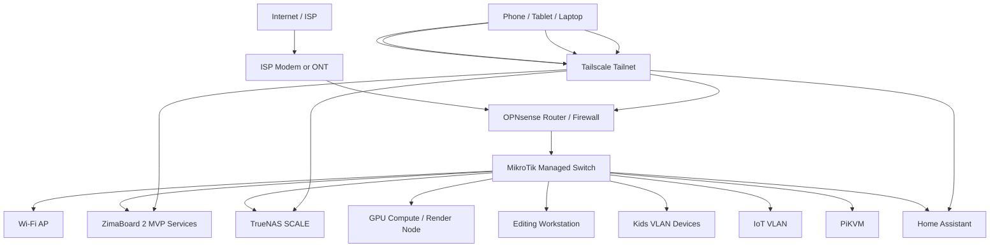

# My Home Server Development Plan

## Goal

I want to build a home server platform over roughly **2 years**, growing it **quarterly**, with a total target budget of **MXN 120,000**.

My end goal is to have:

- A serious **personal cloud / Google replacement**
- A **TrueNAS SCALE** storage server
- A **mini render farm** for 3D work
- **Local LLMs** and AI automations
- **AI video generation** workflows
- **Plex**
- **n8n** automations
- **personal app hosting**
- **automatic backups**
- **10GbE** on my local network where it matters
- **remote access** from my phone, tablet, and laptops using **Tailscale**
- **Google Home** integration
- **internet safety controls for children**

I also want to build this in a way that is as **future-proof** as possible.

## Core Design Principles

I am deliberately **not** building one giant all-in-one machine first.

Instead, I will split the project into **four roles**:

1. **Router / security box**
   - OPNsense
   - VLANs
   - DNS filtering
   - family-safe internet rules
   - Tailscale subnet router / exit node

2. **Personal cloud / services box**
   - starts with ZimaBoard 2
   - runs my MVP services fast
   - low power and easy to maintain

3. **TrueNAS SCALE storage box**
   - dedicated to protected storage
   - designed for stability, ZFS, snapshots, and backups

4. **GPU compute / render box**
   - dedicated to Blender, AI, containers, and experiments
   - separate from storage so GPU heat and driver churn do not destabilize the NAS

This is the most important architectural decision in the whole build.

## Reality Checks I Accept Up Front

### 1. My mini rack is not my final rack

The **DeskPi RackMate T2 12U 10-inch rack** is a good fit for:

- router
- switch
- patch panel
- mini PCs
- PiKVM
- ZimaBoard
- PDU

It is **not** the right physical platform for the final combination of:

- large multi-drive TrueNAS
- dual GPUs
- big PSU
- long full-size PCIe cards

So I will use the mini rack for the **network/control layer**, and I will keep the storage and GPU towers near it or move to a larger rack later.

### 2. 148 TB needs definition

I need to distinguish between:

- **raw capacity**
- **usable protected capacity**

If I say **148 TB raw**, that is much easier.

If I say **148 TB usable with redundancy**, the budget gets much tighter.

For planning, I will treat **148 TB as my stretch endgame target**, and I will target a more realistic protected midpoint first:

- **16 TB protected** in MVP
- **64 TB to 96 TB protected** in the main storage phase
- growth toward the final higher-capacity array later

### 3. For AI, VRAM matters more than “number of GPUs”

For local AI, two 8 GB cards do **not** behave like one 16 GB card in most normal workflows.

That means:

- an **RTX 5060 8GB** is acceptable for light inference and video tasks
- an **RTX 3070 8GB** is still useful for rendering and some AI tasks
- an **RTX 5060 Ti 16GB** is much more strategically valuable for local AI than another 8 GB card

So if I buy one new GPU for the long term, I should strongly prefer the **5060 Ti 16GB**.

## My Final Architecture

### Network layer

- ISP modem or ONT
- OPNsense router/firewall
- managed switch
- VLAN segmentation
- optional dedicated Wi-Fi APs later

### Services layer

- ZimaBoard 2 for MVP and lightweight apps
- Home Assistant
- Immich
- Nextcloud or Syncthing
- n8n
- AdGuard Home

### Storage layer

- TrueNAS SCALE
- ZFS pools
- mirrored boot SSDs
- mirrored NVMe app pool
- HDD data pool
- snapshots and replication

### Compute layer

- Ubuntu or Debian GPU node
- Docker
- NVIDIA Container Toolkit
- Ollama
- Open WebUI
- ComfyUI
- Blender / render workloads

## Why I Am Choosing These Platforms

## TrueNAS SCALE

I want **TrueNAS SCALE**, not CORE, because my future includes:

- ZFS storage
- apps
- containers
- Linux ecosystem compatibility

TrueNAS’s current hardware documentation also keeps the basic minimum simple and still expects standard x86 hardware with SSD boot devices and adequate RAM.

## ZimaBoard 2 for the MVP

I want my first stage to go live fast and stay useful later.

The **ZimaBoard 2** works well for that because it gives me:

- Intel N150
- up to 16 GB RAM
- 2 x SATA
- 2 x 2.5GbE
- PCIe expansion
- low power draw

It is not my final NAS, but it is a very good **first personal cloud node**.

## OPNsense for routing and family controls

I want a proper firewall/router instead of overloading the NAS.

OPNsense gives me:

- VLAN support
- policy controls
- DNS-based blocking
- traffic segmentation
- safer internet for kids
- room to grow into more advanced rules later

## Tailscale for remote access

I want remote access without fighting public IP issues or exposing ports.

Tailscale gives me:

- simple device-to-device remote access
- subnet routing to reach home devices
- exit node support if I want full tunnel behavior from the road

## Recommended End-State Software Stack

### Storage and file services

- **TrueNAS SCALE**
- **SMB** for Windows and editing shares
- **NFS** where Linux containers or render nodes benefit from it

### Personal cloud

- **Immich** for photos and mobile backup
- **Nextcloud** if I want a fuller Google Drive replacement
- **Syncthing** if I want faster device-to-device sync with less complexity

### Smart home

- **Home Assistant**
- **Google Home integration**

### Media

- **Plex**

### Automation

- **n8n**

### AI

- **Ollama**
- **Open WebUI**
- **ComfyUI**

### Network safety

- **OPNsense**
- **AdGuard Home**
- optional SafeSearch and category restrictions via DNS policies

### Backup

- ZFS snapshots
- local replication
- USB cold backup or second box
- optional cloud backup for irreplaceable documents only

## Quarterly Plan

## Q1: MVP Personal Cloud

In the first quarter, my goal is to get a real service online fast.

### What I will build

- ZimaBoard 2 as my first self-hosted node
- 2 x 16 TB CMR drives in a mirrored pair
- Tailscale remote access
- Immich for phone photo backup
- basic file sharing
- UPS protection from day one

### Why this is the right first step

This gives me a functioning “Google replacement” MVP immediately without waiting for the full rack, full NAS, or render infrastructure.

### Services I will deploy first

- Tailscale
- Immich
- Nextcloud or Syncthing
- basic SMB share
- optional Plex only if resource usage stays reasonable

### Success criteria

- my phone backs up photos automatically
- I can access files remotely
- my wife and I can use it reliably
- I have at least one protected storage copy

## Q2: Network Foundation

In the second quarter, I will stop treating the network like an afterthought.

### What I will build

- OPNsense mini PC
- managed switch
- VLAN design
- DNS filtering for family safety
- structured routing between trusted and untrusted devices

### VLANs I will create

- `LAN`
- `Servers`
- `Kids`
- `IoT`
- `Guest`
- `Management`

### Why I want this now

This phase gives me:

- safer smart home devices
- internet controls for children
- better visibility into traffic
- cleaner scaling when more devices appear later

## Q3: Rack and Remote Control

In the third quarter, I will make the setup organized and maintainable.

### What I will add

- DeskPi RackMate T2
- patch panel
- compact PDU
- cable management
- PiKVM

### Why PiKVM matters

I want BIOS-level remote access and headless recovery capability for small servers and mini PCs.

That will save time every time something fails remotely or boots badly.

## Q4: First 10GbE Path

In the fourth quarter, I will add high-speed networking only where it brings real value.

### First 10GbE targets

- NAS to editing workstation
- NAS to render/compute workstation

### My networking rule

I will not force 10GbE across the entire house early.

I will put 10GbE only on the paths that move:

- video files
- renders
- AI datasets
- backups

### Preference

Where practical, I will prefer:

- **SFP+ NICs**
- **DAC cables**
- fiber where needed

instead of 10GBase-T RJ45, because SFP+ is usually:

- cheaper
- cooler
- quieter
- easier to scale cleanly

## Q5: TrueNAS SCALE Platform Build

In the fifth quarter, I will build the real storage platform.

### My priorities

- stability
- ZFS integrity
- room for drive growth
- enough RAM
- proper HBA
- good airflow

### My storage box target

- Intel CPU with iGPU
- ECC RAM if possible
- 64 GB RAM minimum
- 128 GB target later
- mirrored boot SSDs
- mirrored NVMe app pool
- LSI/Broadcom HBA in IT mode
- CMR HDDs only

### Chassis direction

I will choose based on room constraints:

- **Fractal Define 7 XL** if I want quiet
- **Jonsbo N5** if I want a denser storage tower
- **Supermicro 846** only if I can tolerate depth and noise

## Q6: TrueNAS Storage Expansion

In the sixth quarter, I will migrate core data onto the real NAS and expand capacity deliberately.

### My rules

- no SMR drives
- no random one-drive-at-a-time chaos
- no messy pool design I regret later

### Capacity goal for this phase

- reach a realistic protected midpoint
- likely **64 TB to 96 TB protected**

### Why this phase matters

This is where the project becomes a serious long-term storage system instead of a hobby box.

## Q7: GPU Compute / Render Node

In the seventh quarter, I will build the compute box.

### What I will use

- my existing **RTX 3070**
- one new **RTX 5060 Ti 16GB** if budget and availability align

### What it will run

- Blender / rendering jobs
- Ollama
- Open WebUI
- ComfyUI
- AI automations
- experimental video generation workflows

### Why I separate this from TrueNAS

- GPU heat is bad for dense HDD environments
- AI stacks change more often than storage stacks
- I want driver freedom without risking the NAS
- I want to reboot compute without disrupting family storage

## Q8: Endgame Polish

In the last quarter of the 2-year plan, I will harden and refine everything.

### Finalization tasks

- complete backup policy
- add more 10GbE endpoints if justified
- improve monitoring and alerting
- refine Google Home integration
- finalize Plex, AI, and app hosting layout
- decide whether I continue expanding toward the 148 TB stretch target

## Budget Plan in MXN

The table below is my planning budget, not a guarantee of market pricing. It is designed to keep me close to **MXN 120,000 total** over 8 quarters.

| Quarter | Focus | Planned Spend (MXN) | Running Total (MXN) |
|---|---:|---:|---:|
| Q1 | ZimaBoard 2 MVP, 2 x 16TB, UPS, cables | 22,000 | 22,000 |
| Q2 | OPNsense mini PC, managed switch, initial DNS safety | 12,000 | 34,000 |
| Q3 | DeskPi rack, patch panel, PDU, PiKVM, cable management | 11,000 | 45,000 |
| Q4 | first 10GbE NICs, SFP+ modules, DACs | 9,000 | 54,000 |
| Q5 | TrueNAS base platform: board, CPU, RAM, boot SSDs, HBA, case | 24,000 | 78,000 |
| Q6 | storage expansion drives and NVMe app pool | 16,000 | 94,000 |
| Q7 | GPU compute node parts, PSU, cooling, one new GPU if possible | 20,000 | 114,000 |
| Q8 | backup target, monitoring polish, replacement parts reserve | 6,000 | 120,000 |

## Budget Notes

### What makes or breaks the budget

The most volatile items are:

- HDD pricing
- GPU pricing
- imported networking gear
- UPS pricing

### My budget strategy

- buy drives only when the price-per-TB is acceptable
- prioritize the **5060 Ti 16GB** over a weaker AI-oriented GPU
- buy used enterprise NICs and HBAs where sensible
- avoid buying 10GbE for rooms that do not need it

## High-Level Shopping Strategy

### Buy new where failure hurts most

- UPS
- PSU
- primary boot SSDs
- main HDDs if possible

### Buy used where the homelab market is strong

- LSI HBA
- Mellanox or Intel 10GbE NICs
- some SFP+ modules
- enterprise rails or accessories

### Delay until justified

- full-house 10GbE
- second large GPU
- giant final-capacity storage expansion

## Recommended Hardware by Role

## 1. Router / Firewall Box

### Target spec

- x86 mini PC
- 4 x 2.5GbE minimum
- Intel NICs preferred if available
- 8 GB RAM minimum
- 16 GB preferred
- low power draw

### Why

I want routing isolated from storage and compute.

## 2. Personal Cloud MVP Box

### Target spec

- ZimaBoard 2 16GB
- 2 x 16TB mirrored
- small SSD or onboard storage for OS

### Why

Fastest path to value.

## 3. Main TrueNAS Box

### Target spec

- Intel platform with iGPU
- ECC-capable motherboard if feasible
- 64 GB RAM minimum
- HBA in IT mode
- 2 x SSD boot mirror
- 2 x NVMe mirror for apps and support workloads

### Why Intel iGPU

I want **Plex Quick Sync** available without depending on the GPU compute node.

## 4. GPU Compute Box

### Target spec

- enough PCIe room for two GPUs
- large PSU with transient headroom
- strong airflow
- ATX or larger board
- plenty of case clearance

### Why

This is where experimentation belongs.

## Network Diagram

## Logical Network Design

### VLAN layout

| VLAN | Purpose | Notes |
|---|---|---|
| LAN | trusted user devices | laptops, desktops, phones |
| Servers | all self-hosted systems | ZimaBoard, TrueNAS, GPU node, Home Assistant |
| Kids | restricted internet profile | filtered DNS and schedule controls |
| IoT | smart home and untrusted appliances | isolated from main LAN |
| Guest | internet only | no local access |
| Management | switches, PiKVM, router admin | tightly limited |

## Service Placement Plan

| Service | Where I run it first | Where it may end up |
|---|---|---|
| Tailscale | ZimaBoard or OPNsense sidecar | router plus selected nodes |
| Immich | ZimaBoard | TrueNAS apps or Linux VM later |
| Nextcloud | ZimaBoard | TrueNAS app or separate VM |
| Syncthing | ZimaBoard | can stay there |
| Home Assistant | mini PC or services box | dedicated small node |
| n8n | ZimaBoard first | dedicated app host later |
| Plex | ZimaBoard only if light | TrueNAS with Intel iGPU |
| Ollama / Open WebUI | GPU node | GPU node |
| ComfyUI | GPU node | GPU node |

## Storage Strategy

## Phase 1

- 2 x 16 TB mirror
- simple and safe

## Phase 2

- TrueNAS pool with planned vdevs
- mirrored boot SSDs
- mirrored NVMe app pool

## My preferred mindset for growth

I will grow storage in **planned groups**, not in random one-off decisions.

That means I will decide:

- target vdev width
- redundancy level
- power and cooling implications
- replacement time and rebuild risk

before I buy the next set of disks.

## Backup Strategy

I want to follow a practical **3-2-1 style** approach over time.

### End-state backup model

- **1 primary copy** on TrueNAS
- **1 secondary local backup** on external drives or another system
- **1 offsite or cloud copy** for the irreplaceable subset only

### What gets highest priority

- family photos
- important documents
- project files
- exported final renders

### What gets lower priority

- easily redownloaded media
- temporary model caches
- scratch render files

## Security and Family Internet Controls

I want this to be practical, not performative.

### Controls I will implement

- DNS filtering via AdGuard Home or equivalent
- Kids VLAN with more restrictive policy
- scheduled internet access windows if needed
- safe search enforcement where practical
- blocklists for malware and adult domains
- separate IoT VLAN

### What I will not do

- put IoT junk on the same trusted network as my storage
- expose services directly to the internet if Tailscale solves the problem better

## Google Replacement Strategy

## Photos

- **Immich** will be my main photo backup and browsing platform

## Drive / file sync

- **Nextcloud** if I want Google Drive-like features
- **Syncthing** if I want lighter and faster sync

## Notes / documents

- optional later
- I will avoid overbuilding this part in phase 1

## Google Home Integration Strategy

I want Google Home integration mainly through **Home Assistant**.

### Easiest path

- use **Home Assistant Cloud**

### Manual path

- configure Google Assistant integration manually
- requires externally accessible Home Assistant with hostname and SSL

### My recommendation

I should start with **Home Assistant Cloud** unless I explicitly want the manual challenge.

## 10GbE Strategy

I only want 10GbE where it creates real value.

### First links I care about

- NAS ↔ editing workstation
- NAS ↔ GPU compute node

### Switch choices

#### Best balanced first switch

- **MikroTik CRS310-8G+2S+IN**
- good when most endpoints are 1GbE or 2.5GbE and only a few are 10GbE

#### Better when I want several real 10Gb links

- **MikroTik CRS309-1G-8S+IN**
- better for an SFP+ heavy homelab

### Compact alternative

- **Ubiquiti Flex XG**
- good as a small 10Gb island
- not enough by itself for the full design

## KVM and Remote Management Strategy

I want remote management in two layers.

### Layer 1: PiKVM

For headless and BIOS-level control, I will use **PiKVM**.

### Layer 2: desk KVM if needed

If I want to switch a monitor and keyboard between local systems, I can add a normal KVM later, but the more strategically important tool is **PiKVM**.

## Implementation Guide

## Stage 1: Build the MVP

### Tasks

- buy ZimaBoard 2
- buy 2 x 16TB CMR HDDs
- buy UPS
- assemble the node
- install ZimaOS or Debian
- install Tailscale
- deploy Immich
- configure phone backup
- create basic shared folders
- test remote access

### Validation checklist

- phone photo backup works
- remote login works over Tailscale
- files are mirrored or otherwise protected
- the system survives reboot cleanly

## Stage 2: Build the Network Core

### Tasks

- install OPNsense box
- replace basic consumer routing if needed
- install managed switch
- create VLANs
- move IoT devices off trusted LAN
- add DNS filtering
- create kids network policy

### Validation checklist

- guests cannot reach server VLAN
- IoT cannot freely reach trusted LAN
- kids policy behaves as expected
- remote Tailscale access still works

## Stage 3: Organize the Rack

### Tasks

- assemble DeskPi rack
- mount switch
- mount patch panel
- mount PDU
- mount ZimaBoard or shelf devices
- route cables
- label cables
- add PiKVM

### Validation checklist

- every cable is labeled
- remote recovery path exists
- airflow is not blocked

## Stage 4: Add 10GbE Where Needed

### Tasks

- install NICs in main transfer endpoints
- add DACs or transceivers
- validate link speed
- benchmark file transfers

### Validation checklist

- large file transfers outperform current baseline
- editing from network share is viable

## Stage 5: Build TrueNAS

### Tasks

- choose case
- assemble board, CPU, RAM, PSU
- install HBA
- install boot SSD mirror
- install NVMe app mirror
- install initial HDD set
- install TrueNAS SCALE
- create pools
- configure shares
- enable snapshots

### Validation checklist

- SMART data visible
- snapshots working
- share permissions working
- boot mirror healthy

## Stage 6: Migrate Data and Expand

### Tasks

- move data from MVP node to TrueNAS
- organize datasets
- define backup priorities
- buy next planned drive group

### Validation checklist

- no critical files remain on temporary-only storage
- backup and restore test is successful

## Stage 7: Build GPU Compute Node

### Tasks

- assemble compute case
- install RTX 3070
- install new GPU when budget allows
- install Ubuntu
- install Docker and NVIDIA toolkit
- deploy Ollama
- deploy Open WebUI
- deploy ComfyUI
- connect to NAS shares

### Validation checklist

- GPUs visible in `nvidia-smi`
- models load correctly
- render workloads can read/write from NAS

## Stage 8: Harden and Finish

### Tasks

- alerting
- UPS shutdown integration
- backup verification
- service documentation
- spare parts tracking

### Validation checklist

- I can recover from a failed disk
- I can recover from a power outage
- I know how to restore my most important data

## Per-Stage Shopping Checklist

## Stage 1 Shopping Checklist

- [ ] ZimaBoard 2 16GB
- [ ] 2 x 16TB CMR HDD
- [ ] UPS
- [ ] SATA/power accessories as required
- [ ] external backup drive if budget allows

## Stage 2 Shopping Checklist

- [ ] OPNsense mini PC
- [ ] managed switch
- [ ] patch cables
- [ ] optional AP upgrade

## Stage 3 Shopping Checklist

- [ ] DeskPi RackMate T2
- [ ] 10-inch patch panel
- [ ] compact PDU
- [ ] cable management accessories
- [ ] PiKVM

## Stage 4 Shopping Checklist

- [ ] 10GbE NIC for NAS
- [ ] 10GbE NIC for editing workstation
- [ ] DAC cables or SFP+ modules

## Stage 5 Shopping Checklist

- [ ] TrueNAS case
- [ ] motherboard
- [ ] CPU
- [ ] RAM
- [ ] PSU
- [ ] HBA in IT mode
- [ ] 2 x boot SSD
- [ ] 2 x NVMe SSD
- [ ] initial HDD group

## Stage 6 Shopping Checklist

- [ ] next planned HDD group
- [ ] spare fan(s)
- [ ] spare SATA/SAS cables

## Stage 7 Shopping Checklist

- [ ] GPU node case
- [ ] motherboard
- [ ] CPU
- [ ] RAM
- [ ] large PSU
- [ ] cooling upgrades
- [ ] RTX 5060 Ti 16GB if budget and availability align

## Stage 8 Shopping Checklist

- [ ] backup media
- [ ] spare drive or cold spare fund
- [ ] labels and documentation materials

## Recommended Link List

### Rack

- DeskPi RackMate T2  
  https://deskpi.com/products/deskpi-rackmate-t2-rackmount-12u-server-cabinet-for-network-servers-audio-and-video-equipment

### MVP platform

- ZimaBoard 2  
  https://www.zimaspace.com/en/products/single-board2-server

### Networking

- MikroTik CRS310-8G+2S+IN  
  https://mikrotik.com/product/crs310_8g_2s_in

- MikroTik CRS309-1G-8S+IN  
  https://mikrotik.com/product/crs309_1g_8s_in

- Ubiquiti Flex XG  
  https://store.ui.com/us/en/category/all-switching/products/usw-flex-xg

### Cases

- Fractal Define 7 XL  
  https://www.fractal-design.com/products/cases/define/define-7-xl/black-solid/

- Jonsbo N5  
  https://www.jonsbo.com/en/products/N5Black.html

- Supermicro 846 family  
  https://www.supermicro.com/en/products/chassis/4U/846/SC846BE1C8-R1K23B4?mlg=0

### Remote management

- PiKVM  
  https://pikvm.org/

### Software references

- TrueNAS SCALE hardware guide  
  https://www.truenas.com/docs/scale/25.04/gettingstarted/scalehardwareguide/

- TrueNAS apps overview  
  https://www.truenas.com/blog/truenas-apps-made-easy/

- Immich requirements  
  https://docs.immich.app/install/requirements/

- Tailscale subnet routers  
  https://tailscale.com/docs/features/subnet-routers

- Tailscale exit nodes  
  https://tailscale.com/docs/features/exit-nodes

- Home Assistant Google Assistant integration  
  https://www.home-assistant.io/integrations/google_assistant

- OPNsense hardware sizing  
  https://docs.opnsense.org/manual/hardware.html

## Final Decision Summary

If I want the cleanest path, this is what I will do:

1. start with **ZimaBoard 2 + 2 x 16TB mirror + UPS**
2. add **OPNsense + managed switch + VLANs**
3. organize with the **DeskPi mini rack**
4. add **selective 10GbE**
5. build a separate **TrueNAS SCALE** box
6. build a separate **GPU compute/render** box
7. harden backups and monitoring

That path gives me the best mix of:

- practicality
- future-proofing
- clean growth
- family usability
- performance where it actually matters
